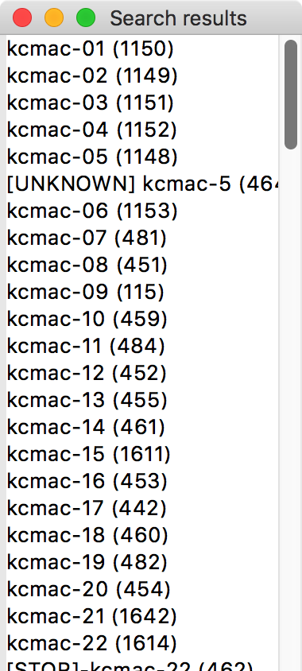
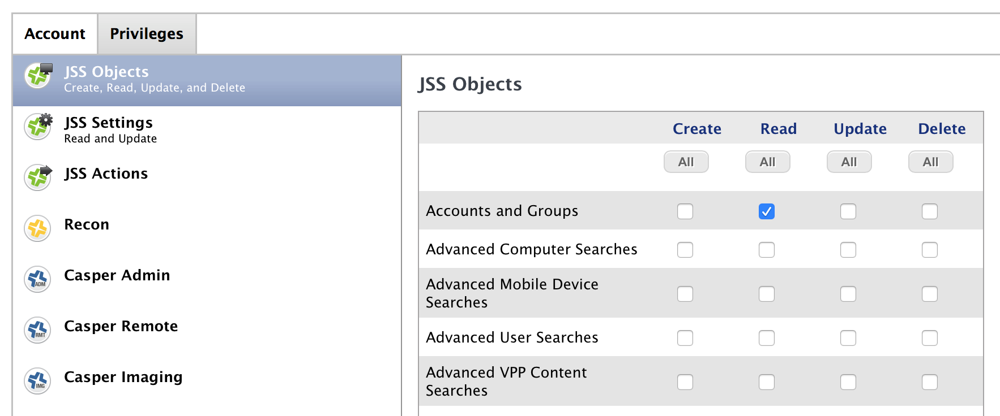

# Cargo Ship

Cargo Ship is designed as a kind of reflection tool, it shows you what Jamf thinks should be on a specific client. It can read from Jamf Pro directly from ID's or by selecting from search results.

This tool is identical to our inhouse version. However it can be customized to fit your environment by modifying it's Python code.

*Note: Offering a tool designed from the outset to be customized at the source level is a new venture for us. If you feel the documentation we've included is not sufficient to help you successfully navigate the source code, please consider raising an issue and we'll do our best to correct any short comings.*

## Contents

- [Download](#download) - get the .dmg
- [Contact](#contact)
- [System Requirements](#system-requirements)
- [Install](#install)
- [Uninstall](#uninstall)
- [Purpose](#purpose)
- [Usage](#usage)
  - [How Does It Work](#how-does-it-work)
  - [Jamf User Privileges](#jamf-user-privileges)
- [Notes](#notes)
- [Update History](#update-history)

## Download

[Download the latest installer here!](../../releases/)

## Contact

If you have any comments, questions, or other input, either [file an issue](../../issues) or [send us an email](mailto:mlib-its-mac-github@lists.utah.edu). Thanks!

## System Requirements

- Python 2.7+ (which you can download [here](https://www.python.org/download/))

If you intend to rebuild customized versions you will need the following tools, depending on your platform:

- py2app for MacOS applications  (which you can download [here](https://pythonhosted.org/py2app/install.html))
- cx_freeze for Windows applications (which you can download [here](https://anthony-tuininga.github.io/cx_Freeze/))

## Install

Place the application in an appropriate location for your environment.

## Uninstall

Remove the application.

## Purpose

The idea behind Cargo Ship began as an offhand remark about how useful it would be to have a tool that could tell you what a machine was supposed to be, what policies applied to it, what groups it belonged to, etc. It also served as a learning tool for the author.

## Usage

On opening the application, provide your Jamf Pro server address, and a user with appropriate privileges.

The first line in the UI contains all of the navigation tools.

**This Device** Open the record for the device the application is running on.

**Other ID** If you know the Jamf ID of the specific machine you'd like to see, enter it in the text field and press the Other ID button.

**Search Jamf** Enter the information you'd like to search for in the text field and press the Search Jamf button. The following image shows the search results window.

Select the machine you'd like to see and its record will load into the display.

#### How Does It Work

Here are the steps that are performed when the application is launched:

1. The user provides the Jamf Pro server address and the user name and password for an account with access to a specific areas of the Jamf database. This area can be customized to include your Jamf server address.
2. The application downloads a list of all policies in the database. This list contains the ID and internal "name" of the policy, which isn't really the proper name. With the list of ID's, it asks the Jamf server for specific information about each identified policy. A list is constructed containing the ID, actual policy name and other qualifying information. This list is then added to a cumulative list of policies.
3. It then downloads the list of profiles (osxconfigurationprofiles). With this list, a cumulative dictionary is built using profile ID as the key, and the name of the profile as the value.
4. *The time required to complete the two previous steps is dependent on the number of policies and profiles defined in your environment. It may take minutes to complete.*
5. The empty UI is created.
6. The user specifies which machine to investigate.
7. The full computer record for the specified machine is downloaded.
8. Specific items are pulled directly from the record and displayed:
   - Computer Name
   - Jamf ID
   - Computer users full name
   - Last checkin time to the Jamf server
9. Specific items are parsed from the record and displayed:
   - Printers
   - Computer groups
   - Extension attributes
   - Installed software (by a local installer package and by Jamf itself)
10. Policies and profiles are cross-referenced between the full record and precreated data structures and finally displayed.

#### Jamf User Privileges

In order to use Jamf's API, your users will need the appropriate rights to certain areas of the database. To check these settings go to the following area: **All Settings**, **System Settings**, **JSS User Accounts & Groups**.

This chart shows the required privileges for Cargo Ship to operate properly:

| Field                         | Create | Read | Update | Delete | Notes                          |
| ----------------------------- | :----: | :--: | :----: | :----: | :----------------------------- |
| Accounts and Groups           |        |  ☑   |        |        | Needed for login functionality |
| Computer Extension Attributes |        |  ☑   |        |        |                                |
| Computers                     |        |  ☑   |        |        |                                |
| OS X Configuration Profiles   |        |  ☑   |        |        |                                |
| Policies                      |        |  ☑   |        |        |                                |

These requirements are also included in the login method. If you make customizations, you may need to add these additional areas to the list of required privileges.

## Notes

Fomerly known as "**The Summerizerator**".

My heartfelt thanks to the other members of the Mac Group and the IT administration of the Marriott Library for their support, bug reports and feature requests!

## Update History

| Date      | Version | Notes                   |
| --------- | ------- | ----------------------- |
| 2017.2.15 | 1.0.0   | Initial public release. |